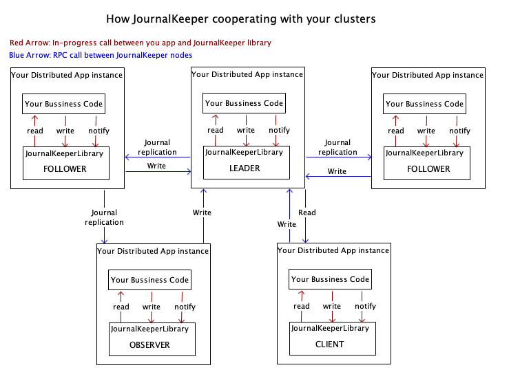

JournalKeeper API
==
JournalKeeper以接口和事件方式对外提供服务，服务的形式为进程内调用。

# 角色
集群所有节点可以配置成如下三种角色中的一种，三种角色为用户提供的API功能完全相同，区别在于性能。
角色 | 本地存储数据 | 参与选举 | 说明
-- | -- | -- | -- 
VOTER | Y| Y| 选民，所有选民构成RAFT集群，拥有选举权和被选举权的节点，可以成为LEADER、FOLLOWER或CANDIDATE三种状态。选民节点数量必须为奇数，建议设置为3/5/7。
OBSERVER | Y| N| 观察者，没有选举权和被选举权的节点，本地存储日志和数据，提供只读服务，从其它选民或者观察者复制日志，更新状态。数据不大的情况下，建议除选民节点外，所有节点都设为观察者。
CLIENT | N| N| 客户端，本地不存储数据，从选民或者观察者节点读取数据，适用于数据量较大的集群。

# Partitioned Journal Store API (JK-PS API)
多分区一致性日志接口和事件。

## 接口
方法 |  说明
-- |  --
append |  写入日志。
get |  查询日志。
minIndices |  当前已提交日志最小位置。
maxIndices |  当前已提交日志最大位置。
compact | 删除旧日志。
scalePartitions | 变更分区数量。
listPartitions | 查询当前所有分区。

### append
写入日志。对于每个partition集群保证按照提供的顺序写入，保证原子性，服务是线性的，任一时间只能有一个客户端使用该服务。日志在集群中被复制到大多数节点后返回。
参数 | 描述
-- | --
partition | 分区
entries[] | 待写入的日志。

返回 | 描述
-- | --
result | 写入结果，包括： **SUCCESS**: 成功。  **FAILED**: 写入失败，写入过程中发生其他错误。
maxIndex | 当前分区日志最大索引位置

### get
查询日志。如果请求的节点是LEADER节点，该服务保证顺序一致性；如果是其它节点，该服务保证顺序一致性，有可能出现因为日志复制不及时读不到最新日志的情况。

参数 | 描述
-- | --
partition | 分区
index | 查询起始位置。
size | 查询的条数。

返回 | 描述
-- | --
result | 读取结果，包括： **SUCCESS**: 成功。 **INDEX_UNDERFLOW**: 参数index不能小于当前minIndex。  **INDEX_OVERFLOW**: 参数index必须小于当前maxIndex。
entries[] | 读到的日志，返回的数据条数为$min(maxIndex - index, size)$

### minIndices maxIndices
查询当前最小/最大已提交日志索引位置，这两个方法都没有请求参数。

返回 | 描述
-- | --
minIndices[]/maxIndices[] | 返回每个分区的最小/最大已提交日志索引位置。

### compact
删除旧日志，只允许删除最旧的部分日志（即增加minIndex）。保证原子性，服务是线性的，任一时间只能有一个客户端使用该服务。在集群中复制到大多数节点都完成删除后返回。
参数 | 描述
-- | --
toIdices[] | 所有分区删除日志索引位置，小于这个位置的日志将被删除。

返回 | 描述
-- | --
result | 写入结果，包括： **SUCCESS**: 成功。  **FAILED**: 失败。
minIndices[] | 当前最小已提交日志索引位置。

### scalePartitions
变更分区数量。
参数 | 描述
-- | --
partitions[] | 变更后的所有分区。

返回 | 描述
-- | --
result | 写入结果，包括： **SUCCESS**: 成功。  **FAILED**: 失败。

### listPartitions
列出当前所有分区，该方法无参数。
返回 | 描述
-- | --
partitions[] | 所有分区数组。

## 事件
事件 | 内容 | 说明
-- | -- | --
onJournalChanged | partition: 分区。 minIndex: 当前日志最小位置。  maxIndex：当前日志最大位置。| 日志变更后触发。
# RAFT API(JK-RAFT API)

JK-RAFT API包括变更状态服务和读取状态服务。所有服务简述如下表：
## 接口
方法 | 说明
-- |  --
update | 写入操作日志变更状态。
query |  客户端查询集群当前的状态。

### update
写入操作日志变更状态。集群保证按照提供的顺序写入，保证原子性，服务是线性的，任一时间只能有一个客户端使用该服务。日志在集群中复制到大多数节点，并在状态机执行后返回。
参数 | 描述
-- | --
entries[] | 待写入的更新操作日志。

返回 | 描述
-- | --
result | 写入结果，包括： **SUCCESS**: 成功。  **FAILED**: 写入失败，写入过程中发生其他错误。

### query
查询集群当前的状态，即日志在状态机中执行完成后产生的数据。该服务保证强一致性，保证读到的状态总是集群的最新状态。
参数 | 描述
-- | --
query | 查询条件。

返回 | 描述
-- | --
result | 按照查询条件获得的集群最新状态。

## 事件

事件 | 参数 | 说明
-- | -- | --
onStateChanged | lastApplied: 当前状态对应日志位置 自定参数 | 集群状态变更

## 状态机

用户需要实现一个状态机，用于JournalKeeper更新状态。状态机只包含一个exec方法，这个方法的输入是当前状态和待执行的更新操作，输出是更新后的状态。方法需要满足原子性和幂等性。

参数 | 描述
-- | --
inputState | 输入状态。
entries[] | 待执行的操作数组。

返回 | 描述
-- | --
outputState | 更新后的状态。

# Journal Keeper Coordinating Service(JK-CS API)

分布式一致性协调服务相关的接口和事件。

## 接口
方法 | 说明
-- | --
set | 设置指定的key的为给定的值，如果key不存在则自动创建，如果key已存在则覆盖。
get | 获取指定key的值。
list | 根据模式返回匹配的key数组。
exist | 判断给定的key是否存在
remove | 删除指定的key
compareAndSet | 如果指定的key值与提供的值相等，则执行set操作。
watch | 监控一组key，当符合条件的任一一个key对应值变化时给出通知并结束watch。
unWatch | 取消监控

### set
设置指定的key的为给定的值，如果key不存在则自动创建，如果key已存在则覆盖。

参数 | 描述
-- | --
key | 键。
value | 值。

返回 | 描述
-- | --
success | 结果，包括： **SUCCESS**: 成功。  **FAILED**: 写入失败，数据未更新。

### get
获取指定key的值。
参数 | 描述
-- | --
key | 键。

返回 | 描述
-- | --
value | 值，节点不存在的时候返回**NULL**。

### list
根据模式返回匹配的key数组。
参数 | 描述
-- | --
regex | 查询条件正则表达式。

返回 | 描述
-- | --
keys[] | 符合条件的key数组。

### exist
判断给定的key是否存在
参数 | 描述
-- | --
key | 键。

返回 | 描述
-- | --
result | 结果，包括： **TRUE**: 存在。  **FALSE**: 不存在。

### remove
根据模式返回匹配的key数组。
参数 | 描述
-- | --
key | 键。

返回 | 描述
-- | --
result | 结果，包括： **TRUE**: 删除成功  **FALSE**: key不存在。

### compareAndSet
如果指定的key值与提供的值相等，则执行set操作。

参数 | 描述
-- | --
compareKey | 比较的key。
compareValue | 期望的值。
setKey | 要更新的key。
setValue | 要更新的值。

返回 | 描述
-- | --
success | 结果，包括： **SUCCESS**: 成功。  **FAILED**: 写入失败，数据未更新。

### watch
监控一组key，当符合条件的任一一个key对应值变化时给出通知并结束watch。
参数 | 描述
-- | --
regex | watch条件正则表达式。

返回 | 描述
-- | --
watchId | 本次watch的唯一ID。

### unWatch
取消监控。
参数 | 描述
-- | --
watchId | 监控唯一ID。
无返回值。

## 事件
事件 | 内容 | 说明
-- | -- | --
onWatch | watchId：监控唯一ID  keyAndValues[]：变更键值数组，数组每个元素包括 {key, oldValue, newValue} | watch: 监控的key发生变化时  watchAndSet: 监控的key等于期望值时

# JournalKeeper Admin API（JK-A API）
集群配置相关的接口和事件。
## 接口
方法 | 说明
-- | --
getServers | 获取集群配置。
updateVoters | 变更选民节点配置。 

### getServers
获取集群配置，所有选民节点和当前的LEADER节点。

返回 | 描述
-- | --
voterAddrs[] | 所有选民节点的地址（含LEADER）。
leaderAddr | LEADER节点地址
observerAddrs[] | 所有观察者节点地址。

### updateVoters
客户端调用LEADER节点变更选民节点配置。
参数 | 描述
-- | --
operation | 操作，ADD：添加，REMOVE：删除
voterAddr  | 需要添加或删除的节点地址。

返回 | 描述
-- | --
result | 变更结果，包括： **SUCCESS**: 成功。 **FAILED**: 变更失败，变更过程中发生其他错误。集群配置仍为变更之前。

## 事件

事件 | 内容 | 说明
-- | -- | --
onLeaderChanged | leader：当前LEADER term：当前任期 | LEADER节点变更
onVotersChanged | voterAddrs：变更后的所有选民节点 | 选民节点配置变更

