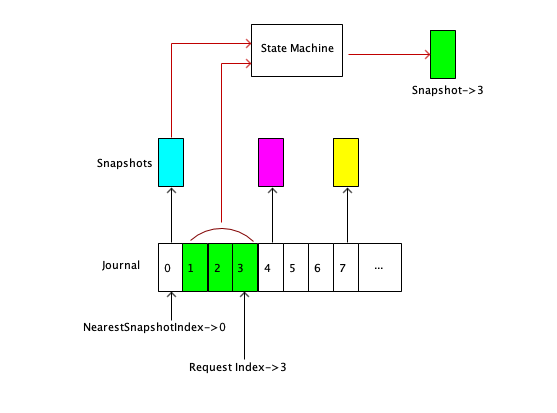
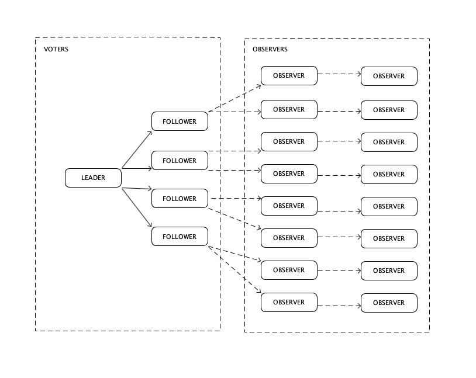

JournalKeeper日志一致性算法
==

JournalKeeper是京东高性能，高可靠，强一致性分布式流数据存储集群。JournalKeeper用来管理超大规模分布式系统一致性算法JournalKeeper衍生于RAFT一致性算法并做了扩展和改进，更加适用于超大规模集群，并且具有更好的性能。它将系统清晰分割成一致性日志、状态机和存储三个部分，使得每一部分都能符合单一职责原则。JournalKeeper明确定义了系统边界，使用更加系统化和结构化的描述方法来定义这个算法，使之易于完整正确的实现并应用到工程实践中。

# 简介

JournalKeeper和大多数一致性算法类似，通过维护一个可靠的、严格顺序的分布式日志来实现一致性。所有对系统变更的操作按照自然时间顺序写入一个日志中，一致性算法保证日志被安全的复制到集群的各个节点上，每个节点都依次将操作日志应用到一个状态机得到确定的状态。 

RAFT在设计上将易于理解放到了很重要的位置，这使得RAFT从一诞生就流行开来。RAFT发布之后，大部分系统都使用RAFT作为其分布式一致性算法。我们在实现RAFT算法并应用到我们的系统的过程中，遇到的问题是，RAFT算法的定义不够系统化和结构化。为了易于理解，RAFT算中更多的使用列举离散的场景和例子来描述其算法，这导致开发者很难将这些离散的描述完整正确的应用到工程实践中。

我们在实现RAFT算法过程中，将其算法总结梳理，以领域模型和流程的方式对算法进行描述，并且明确了算法的线程模型，使之更加易于用现代的面向对象语言进行实现。

RAFT保证严格一致性（Strict Consistency）语义，即：“从存储器地址X处读出的值为最近写入X的值”，并且提供可靠性（Reliability）保证，一个2n+1个节点组成的集群中，只要还有超过（含）n个节点正常工作，就可以保证系统能正常提供服务且数据的不丢失。代价是，RAFT牺牲了可用性（Availability），集群在选举过程中是无法提供服务的。RAFT在性能上并不能发挥出集群多节点的优势，事实上，集群的节点数量越多，集群的性能反而越差。可用性和性能的问题使得RAFT并不适合直接应用于大规模分布式系统中。

JournalKeeper在支持严格一致语义的同时，提供了一种更宽松的一致性语义：顺序一致（Sequential Consistency）。顺序一致不要求在同一时刻所有节点的状态都保证完全相同，只要保证集群各节点按照一致的顺序保存同一份日志即可。在确保一致性语义的前提下，JournalKeeper可以充分发挥集群多节点的优势，把读操作分散到集群的所有节点上从而大幅提升集群的性能。

JournalKeeper将系统从逻辑上清晰分割成一致性日志、状态机和存储，明确的划分了这个三部分的边界并定义了接口。这样划分的意义在于，在工程实践中，不是所有应用场景都需要完整的三部分，例如，一个发布/订阅系统（Pub/Sub System）不需要状态机，一个分布式的令牌桶不需要持久化任何数据。开发者可以根据应用场景有选择的裁减掉状态机或存储部分，依然保证系统的一致性和安全性。

JournalKeeper继承了RAFT简单、易于理解的特性，相比RAFT更加易于实现。它扩展了一致性算法的适用场景，使之更贴近工程实践的实际需求。JournalKeeper在一致语义下，相比RAFT性能有显著的提升，更加符合大规模集群需要超高吞吐量场景的性能需求。

# 顺序一致性

严格一致是一个非常理想的一致性语义，Paxos、RAFT等一致性算法通过单节点读写的实现严格一致性。集群的所有节点被分为如下2种角色：

* **LEADER：** 集群只在LEADER上提供读写服务，所有的操作变更和状态读取都需要通过LEADER完成；
* **FOLLOWER：** 作为LEADER的后备节点，不提供读写服务，只从LEADER同步数据。当LEADER失效时发起或参与选举，选出新的LEADER，以保证集群的可靠性和可用性；

读取的过程比较简单，直接将LEADER存储的状态返回给客户端即可。写入的过程是：
1. 在LEADER节点上写入操作日志；
2. 将日志发送给所有FOLLOWER节点；
1. 所有FOLLOWER节点收到LEADER的命令后，各自写入日志，然后给LEADER发送写入成功响应；
1. LEADER收到超过半数节点的写入成功的响应后，将操作应用到状态机上，确认操作生效；

在将RAFT应用到大规模集群过程中，我们遇到了如下一些问题：

首先是性能问题。RAFT单节点读写的模型限制了集群性能上限，并且不能通过水平扩容来提升性能。写入过程中，由于要将日志复制到超过半数的节点，使得集群的节点越多，写入的性能反而越慢。同一个LEADER节点需要同时提供读写服务，进一步增加了LEADER节点的负荷。因此，RAFT集群性能不会超过单节点性能的上限。

此外，RAFT牺牲了一定的可用性用来换取一致性。RAFT在LEADER和所有FOLLOW间维护一组心跳，当LEADER节点失效时，FOLLOW节点通过心跳超时感知到LEADER节点失效，发起选举。经过一系列选举过程选出新的LEADER后，新LEADER接替旧的LEADER继续提供服务。集群在选举过程中，由于没有LEADER，处于不可用状态。

性能和可用性上的限制使得RAFT很难直接应用于超高并发的大规模分布式集群。JournalKeeper需要在系统的一致性、性能和可用性方面探索出新的平衡点。

在实际工程应用中，很多系统可以接受只保证最终一致性。最终一致性是弱一致性的特殊形式，系统中的某个数据被更新后，后续对该数据的读取操作可能得到更新后的值，也可能是更改前的值。但经过“不一致时间窗口”这段时间后，后续对该数据的读取都是更新后的值. 系统保证在没有新的更新的条件下，最终所有的访问都是最后更新的值。

JournalKeeper在支持强一致的同时，提供另外一种比更宽松的高性能一致性实现：顺序一致性，来缓解性能和可用性的问题。顺序一致不要求在同一时刻所有节点的状态都保证完全相同，只要保证集群各节点按照一致的顺序保存同一份日志即可。

从一致性的限制强度来说：

强一致 > 顺序一致 > 最终一致 

满足强一致的系统一定满足顺序一致，满足顺序一致的系统一定满足最终一致，反之则未必。

将一致性约束放宽至顺序一致的前提下，JournalKeeper的所有的节点都可以提供读服务，实现了读写分离，大幅提高了集群整体的读性能。并且，可以通过增加FOLLWER的数量来水平扩容，集群的节点数量越多，总体的读性能越好。通过将读请求的压力从LEADER分流到FOLLOWERS上去，相对的提高了写入性能。

在LEADER失效后的选举过程中，虽然和强一致一样不能提供写服务，但是其它的FOLLOWER依然可以提供读服务。相比强一致，顺序一致的可用性相对更好。

在实际大规模集群应用中，我们建议将两种一致性混合使用，在一致性、性能和可用性三方面达到一个相对最优的平衡。
* 对于事务操作等需要强一致的流程，通过LEADER读写确保强一致；
* 对于大多数不需要严格一致的读请求，通过FOLLOWER读取；

例如，在一个典型的交易系统中，交易相关的流程需要确保严格一致性，所有的读写请求都由LEADER提供服务；而为用户提供查询账户余额、流水等读请求不需要严格一致，可以分布到各个FOLLOWER中读取。

# 读请求分流

如果不放宽强一致的语义限制，是否能让FOLLOWER分担一部分请求呢？JournalKeeper提供了一种二步读取的方法在保证强一致的前提下来分流LEADER上的读请求。

复制状态机（Replicated State Machine）是一致性算法的的基础。集群的所有节点上维护一个顺序一致、尾部写入、不可变的日志，如果能保证所有节点上的日志完全相同，在任何一个节点上将日志依次在相同的状态机里面执行，执行结果（也就是节点上的状态）必然是一样的。这样，就实现了所有节点状态一致性。

图一：复制状态机

一致性算法的需要解决的核心问题就是如何在所有节点上维护一组相同的一致性日志，确保在恰当的时刻执行状态机。

实际上，在任何时刻都保证集群所有节点的日志完全一致是几乎不可能实现的理想状态。虽然集群的状态是在不断变化的，集群中所有节点日志的进度也不可能完全相同，但至少我们可以得出以下结论：

* 如果两个节点上的日志完全相同，并且这些日志都已经被状态机执行，那么这两个节点的状态是相同的。

进一步的，如果每增加一条日志，变更一次状态，就保存一次当前状态的快照（Snapshot），每个快照对应了日志中的一条特定日志的索引，那么具有相同索引的快照是相同的。如图二，可以推断得出：
* 对于确定的一个索引序号，在集群任何节点上，如果存在该索引序号对应的快照，那么从快照读到的状态都是相同的。

图二：快照

基于这个推断，使得在保证强一致性的前提下，将读请求分流至集群的FOLLOWER节点成为可能，方法如下：
* 所有的写请求由LEADER节点处理，这一点和RAFT一致；
* 客户端在读取状态的时候，首先去LEADER获取当前的提交位置(Commit Index)，然后使用这个位置作为参数去集群任意一个FOLLOWER节点上读取该位置对应快照的状态；

需要注意的是，客户端在FOLLOWER节点上读取的时候，有可能日志还没有被复制到这个FOLLOWER节点，也就读不到最新的状态。客户端需要处理这一情况，解决的方法有两种：
1. 多次重试，经过一段时间后请求位置的日志最终总会复制到集群的所有节点上；
2. 更换节点重试，如果一个节点多次重试失败，可以更换节点读取。

考虑到每增加一条日志就创建一个快照的时间成本和存储成本比较高，使用稀疏快照是一种相对更经济的方式。稀疏快照的实现方式是，每隔若干条日志创建一个快照。

稀疏快照在处理带**请求位置（Request Index）** 的读请求时，如果请求位置存在对应的快照，直接从快照中读取状态返回；如果请求位置不存在对应的快照，那么需要找到一个存在对应快照的日志，我们称为**最近快照日志(Nearest Snapshot Index)**，这个日志的位置需要同时满足：
1. 日志位置比请求位置小；
2. 日志位置距离请求位置最近； 

以这个最近快照日志对应的快照为输入，从最近快照日志开始（不含）直到请求位置（含）依次在状态机中执行这些日志，执行完毕后得到的快照就是请求位置的对应快照，读取这个快照的状态返回给客户端即可。

图三：稀疏快照

如图三所示，客户端的读请求中的请求位置为3（RequestIndex = 3），先找到最近快照位置0（NearestSnapshotIndex = 0），然后以最近快照位置对应的快照作为输入，在状态机中依次应用范围(0, 3]的日志，得到的位置3对应的快照。

# 观察者

JournalKeeper实现了读请求分流到LEADER上，可以通过水平扩展集群的节点数量来线性的提升集群整体的读吞吐量。RAFT在选举和复制时都要遵循大多数原则：
* 选举时，要求收到超过半数选票的CANDIDATE才能成为LEADER。
* 复制时，要求日志复制到超过半数的节点上，才能提交日志。

大多数原则限制了RAFT集群的规模，一般来说，集群的节点数设置为3、5或7个，更多的节点数量会显著拖慢选举和复制的过程。受限于一致性的要求，LEADER只能顺序处理写入请求，处理写入请求过程中需要等待数据安全复制到大多数节点上。集群节点越多，LEADER的出流量更高，复制的时延更大，将导致集群的写入的性能下降。类似的，集群节点越多，选举的过程越慢，由于选举过程中集群是处于不可用状态的，过多的节点数量会降低集群的可用率。

为了提高集群的吞吐量，我们系统用更多的节点数量分摊压力，但增加节点数量又会导致集群的写性能和可用率下降。

JournalKeeper提出了一种新的角色 **观察者(OBSERVER)** 来解决这一矛盾。集群中的节点被划分为如下2种角色：
* **选民（VOTER）** 拥有选举权和被选举权的节点，可以成为LEADER、FOLLOWER或CANDIDATE三种状态。
* **观察者（OBSERVER）** 没有选举权和被选举权的节点，提供只读服务，只从集群的其它节点上复制已提交的日志。

选民即RAFT中的所有节点，可以成为LEADER、FOLLOWER或CANDIDATE，参与选举和复制过程。观察者从集群的其它节点拉取已提交的日志，更新自己的日志和提交位置。观察者节点提供和选民节点完全相同的读服务。

观察者既可以从选民节点拉取日志，也可以从其它观察者节点拉取日志。每次拉取日志时，观察者节点将自身的提交位置作为参数，从集群的其它节点读取日志数据，将日志保存到本地后更新自身的提交位置，完成一次日志复制过程。这个日志拉取复制的过程和RAFT主从复制的主要区别是：为观察者节点提供日志的节点无需维护观察者节点的状态，观察者节点也无需固定从某一个节点上拉取数据。

观察者对于选民来说是透明的，选民无需感知观察者，这样确保RAFT中定义的选举和复制的算法无需做任何变更，不破坏原有的安全性。观察者可以提供和所有选民一样的读服务，因此可以通过增加观察者的数量来提升集群的吞吐量。观察者不参与选举和复制的过程，增加观察者的数量不会拖慢选举和复制的性能。

图四：带观察者的多级复制集群拓扑，图中的连续表示日志复制，箭头表示日志复制的方向，实线为RAFT主从复制，虚线为OBSERVER从父节点上拉取复制。

集群节点超过一定数量时，大量的观察者节都从少量的选民节点拉取数据，可能会导致网络拥塞。这种情况下，如图四所示，可以使用多级复制的结构来分散日志复制的流量。需要注意的是，复制的层级越多，处于边缘的节点更新到最新状态的所需的时间越长。

# 并行复制
RAFT的论文中提到，在LEADER可以**并行**向所有FOLLOWER复制日志。对于同一FOLLOWER不同的日志能否并行复制呢？RAFT的论文中并没有给出说明。大部分RAFT的实现都采用了简单且安全串行复制的实现：在LEADER上对于每个FOLLOWER，需要等到上一个AppendRequest RPC的响应后再发送下一个AppendRequest RPC请求。

JournalKeeper在保证一致性的前提下，给出了一种并行复制的算法，能显著降低日志复制的平均时延，提升总体吞吐量。

并行复制的思路是，LEADER并行发送复制请求，FOLLOWER中维护一个按照日志位置排序请求列表，按照日志位置串行处理这些复制请求，LEADER按照位置顺序处理响应。

JournalKeeper中LEADER为每个FOLLOWER维护3个位置：
* **nextIndex**：记录需要发给它的下一个日志条目的索引（初始化为领导人上一条日志的索引值 +1）;
* **matchIndex**：记录已经复制到该服务器的日志的最高索引值（从 0 开始递增）;
* **repStartIndex**：记录所有在途的日志复制请求中日志位置的最小值（初始化为nextIndex）；

在LEADER上对于每个FOLLOWER，如果存在一批日志，它们的索引位置不小于nextIndex，LEADER需要更新nextIndex（nextIndex自增本次发送的日志条数）然后给这个FOLLOWER发送AsyncAppendRequest RPC请求。LEADER可以同时给同一个FOLLOWER发送多个AsyncAppendRequest RPC请求并行复制。
AsyncAppendRequest RPC请求的参数和返回值如下：
参数 | 描述
-- | --
term | LEADER的任期号
leaderAddr | LEADER的地址，为了其他服务器能重定向到客户端
prevLogIndex | 发送日志之前的日志的索引值
prevLogTerm | 发送日志之前的日志的领导人任期号
entries[] | 将要存储的日志条目（表示 heartbeat 时为空，有时会为了效率发送超过一条）
leaderCommit | LEADER上当前的提交位置

返回值 | 描述
-- | --
term | 当前的任期号，用于领导人更新自己的任期号
success | 如果其它服务器包含能够匹配上 prevLogIndex 和 prevLogTerm 的日志时为真
logIndex | 请求中第一条日志的位置
entryCount | 请求中日志的数量

### LEADER

对于每一个AsyncAppendRequest RPC请求，当收到成功响应的时需要更新repStartIndex、matchIndex和commitIndex。由于接收者按照日志的索引位置串行处理请求，一般情况下，收到的响应也是按照顺序返回的，但是考虑到网络延时和数据重传，依然不可避免乱序响应的情况。LEADER在处理响应时需要遵循：
* 对于所有响应，先比较返回值中的term是否与当前term一致，如果不一致说明任期已经变更，丢弃响应，
* LEADER 反复重试所有term一致的超时和失败请求（考虑到性能问题，可以在每次重试前加一个时延）；
* 对于返回失败的请求，如果这个请求是所有在途请求中日志位置最小的（`repStartIndex == logIndex`），说明接收者的日志落后于repStartIndex，这时LEADER需要回退，再次发送AsyncAppendRequest RPC请求，直到找到FOLLOWER与LEADER相同的位置。
* 对于成功的响应，需要按照日志索引位置顺序处理。规定只有返回值中的logIndex与repStartIndex相等时，才更新repStartIndex和matchIndex，否则反复重试直到满足条件；
* 如果存在一个索引位置N，这个N是所有满足如下所有条件位置中的最大值，则将commitIndex更新为N。
    * 超过半数的matchIndex都大于N
    * N > commitIndex

### 接收者
  
RAFT的复制算法中，接收者通过比较当前复制位置前一条日志的任期号来确定是否要接受这批日志复制请求，JournalKeeper也要遵循这一原则，因此接收者需要按照日志位置串行处理AsyncAppendRequest RPC请求。
**需要特别注意的是，选民节点并不是只有状态为FOLLOWER才处理AsyncAppendRequest RPC请求，选民节点在任何状态下（包括LEADER状态）都需要处理AsyncAppendRequest RPC。** 
接收将所有抽到的请求暂存到一个按照日志索引位置排序的有序列表中，每次从列表中取第一个请求顺序处理。处理的逻辑同RAFT：
1. 如果 term < currentTerm返回 false
1. 如果 term > currentTerm且节点当前的状态不是FOLLOWER，将节点当前的状态转换为FOLLOWER；
1. 如果在prevLogIndex处的日志的任期号与prevLogTerm不匹配时，返回 false
1. 如果一条已经存在的日志与新的冲突（index 相同但是任期号 term 不同），则删除已经存在的日志和它之后所有的日志
1. 添加任何在已有的日志中不存在的条目
1. 如果leaderCommit > commitIndex，将commitIndex设置为leaderCommit和最新日志条目索引号中较小的一个

# 迁移LEADER

在实际生产中为了便于运维和管理，我们希望在集群一切正常的情况下LEADER能固定在某个节点上，而不是随机选举产生。例如：
* 集群的节点服务器配置不同时，我们希望配置较高的节点作为LEADER。
* 多个集群共享一组服务器的情况下，我们希望每个集群的LEADER尽可能的均匀分布在这些服务器上。

因而，需要一种安全的方法将集群的LEADER迁移到指定的节点上。例如，需要将LEADER从节点$S_{old}$迁移到$S_{new}$，迁移过程中需要一个迁移协调者节点协调迁移过程：
1. 通知节点$S_{old}$暂停写入服务；
1. 等待日志同步：等待$S_{old}$节点上所有日志都提交完成，等待$S_{new}$节点上的日志的提交位置与$S_{old}$相同。
1. 通知节点$S_{new}$节点，将选举任期自增1，然后给集群所有节点发送RquestVote RPC；
1. 反复检查，等待选举完成，直到节点$S_{new}$成为新的LEADER。

在极少数情况下（例如，迁移过程中出现网络异常等）有可能会出现集群新选举出来的LEADER不是节点$S_{new}$，因此迁移协调者需要检查选举结果，必要的时候进行重试迁移过程。

# JournalKeeper一致性算法

JournalKeeper一致性算法衍生自RAFT，它完整的实现了RAFT算法，并在此基础上扩展了若干功能，提升了性能。在实现层面，针对RAFT描述不太明确的地方，给出了明确的实现建议。

需要说明的是，JournalKeeper没有任何在功能上和算法对RAFT进行任何修改，在RAFT算法功能覆盖范畴内，JournalKeeper算法上等同于RAFT。

在算法的定义和描述层面，JournalKeeper倾向于使用更加系统化和结构化的方法进行定义，使之更易于实现。在以下算法定义的章节中，所有和RAFT相同概念，我们都采用相同的名词描述。

## 服务

JournalKeeper以接口和事件方式对外提供服务，服务的形式可以是远程调用或者进程内调用。服务包括变更状态（写入操作日志）服务、读取状态服务和集群配置服务。所有服务简述如下表：
### 接口
方法 | 节点 | 说明
-- | -- | --
updateClusterState | LEADER | 客户端调用LEADER节点写入操作日志变更状态。
queryClusterState | LEADER | 客户端查询集群当前的状态，保证强一致。
queryServerState | ALL | 客户端查询节点当前的状态，该服务不保证强一致性，只保证顺序一致
lastApplied | LEADER | 客户端调用LEADER节点查询集群最新提交位置，用于二步读取。
querySnapshot | ALL | 客户端查询任意节点上指定日志位置对应快照的状态，用于二步读取。
getServers | ALL | 客户端查询任意节点获取集群配置。
updateVoters | LEADER | 客户端调用LEADER节点变更选民节点配置。 
updateObservers | LEADER | 客户端调用LEADER节点变更观察者节点配置。

### 变更状态服务

#### updateClusterState
客户端调用LEADER节点写入操作日志变更状态。集群保证按照提供的顺序写入，保证原子性，服务是线性的，任一时间只能有一个客户端使用该服务。日志在集群中复制到大多数节点，并在状态机执行后返回。
参数 | 描述
-- | --
entries[] | 待写入的日志。

返回 | 描述
-- | --
result | 写入结果，包括： **SUCCESS**: 成功。 **NOT_LEADER**: 当前节点不是LEADER，不可写。  **FAILED**: 写入失败，写入过程中发生其他错误。
leaderAddr | 当result = NOT_LEADER时，返回LEADER的地址。

### 查询状态服务

#### queryClusterState
客户端调用LEADER节点查询集群当前的状态，即日志在状态机中执行完成后产生的数据。该服务保证强一致性，保证读到的状态总是集群的最新状态。
参数 | 描述
-- | --
query | 查询条件。

返回 | 描述
-- | --
state | 按照查询条件获得的集群最新状态。

#### queryServerState
客户端调用任意节点查询节点当前的状态，即日志在状态机中执行完成后产生的数据。该服务不保证强一致性，只保证顺序一致，由于复制存在时延，集群中各节点的当前状态可能比集群的当前状态更旧。
参数 | 描述
-- | --
query | 查询条件。

返回 | 描述
-- | --
state | 按照查询条件获得的节点最新状态。
lastApplied | state对应的日志位置

#### lastApplied
客户端调用LEADER节点查询集群最新提交位置，用于二步读取。

返回 | 描述
-- | --
result | 查询结果，包括： **SUCCESS**: 成功。 **NOT_LEADER**: 当前节点不是LEADER。
appliedIndex | 当查询成功时返回集群当前状态对应的日志位置。
leaderAddr | 当result = NOT_LEADER时，返回LEADER的地址。

#### querySnapshot
客户端查询任意节点上指定日志位置对应快照的状态，用于二步读取中，在非LEADER节点获取状态数据。
参数 | 描述
-- | --
logIndex | 待查询快照对应的日志位置。
query | 查询条件。

返回 | 描述
-- | --
success | 查询结果，包括： **SUCCESS**: 成功。 **INDEX_OVERFLOW**: 请求位置对应的快照尚未生成。 **INDEX_UNDERFLOW**：请求位置对应的快照已删除。
state | 查询成功时返回按照查询条件获得的快照状态。

### 集群配置服务

#### getServers
客户端查询任意节点获取集群配置，返回集群所有选民节点和当前的LEADER节点。需要注意的是，只有LEADER节点上的配置是最新且准确的，在其它节点上查询到的集群配置有可能是已过期的旧配置。

返回 | 描述
-- | --
voterAddrs[] | 所有选民节点的地址（含LEADER）。
leaderAddr | LEADER节点地址
observerAddrs[] | 所有观察者节点地址。

#### updateVoters
客户端调用LEADER节点变更选民节点配置。集群保证原子性，服务是线性的，任一时间只能有一个客户端使用该服务。集群成功变更返回。
参数 | 描述
-- | --
operation | 操作，ADD：添加，REMOVE：删除
voterAddr  | 需要添加或删除的节点地址。

返回 | 描述
-- | --
result | 变更结果，包括： **SUCCESS**: 成功。 **NOT_LEADER**: 当前节点不是LEADER。  **CLUSTER_NOT_AVAILABLE**: 集群不可用，可能正在选举。 **FAILED**: 变更失败，变更过程中发生其他错误。集群配置仍为变更之前。
leaderAddr | 当result = NOT_LEADER时，返回LEADER的地址。

#### updateObservers
客户端调用LEADER节点变更观察者节点配置。集群保证原子性，服务是线性的，任一时间只能有一个客户端使用该服务。集群成功变更返回。
参数 | 描述
-- | --
toBeAdded[] | 需要新增的节点地址。
toBeRemoved[] | 需要删除的节点地址。

返回 | 描述
-- | --
result | 变更结果，包括： **SUCCESS**: 成功。 **NOT_LEADER**: 当前节点不是LEADER。  **CLUSTER_NOT_AVAILABLE**: 集群不可用，可能正在选举。  **FAILED**: 变更失败，变更过程中发生其他错误。集群配置仍为变更之前。
leaderAddr | 当result = NOT_LEADER时，返回LEADER的地址。

### 事件

事件 | 内容 | 说明
-- | -- | --
onLeaderChanged | leaderAddr：当前LEADER term：当前任期 | LEADER节点变更
onStateChanged | logIndex：集群状态对应的日志索引序号| 集群状态变更
onVotersChanged | voterAddrs：变更后的所有选民节点 | 选民节点配置变更

## 领域模型

JournalKeeper的领域模型如图五所示：

图五：JournalKeeper 领域模型

* **Server**: Server就是集群中的节点，它包含了存储在Server上日志（logs[]），一组快照（snapshots[]）和一个状态机（stateMachine）实例。
* **Observer**: Observer继承自Server，是角色为观察者的Server抽象。
* **Voter**: Voter继承自Server，是角色为选民的Server抽象。Voter等同于RAFT中的Server。包含一个voterState属性，在**LEADER**、**FOLLOWER**和**CANDIDATE**之间转换。
* **StateMachine**: Statemachine代表状态机，用于执行日志，获取状态。

## Server模块
Server就是集群中的节点，它包含了存储在Server上日志（logs[]），一组快照（snapshots[]）和一个状态机（stateMachine）实例。
### 方法
Server提供[服务](#服务)一章中定义的所有方法供客户端调用，还包含如下几个内部使用的方法：
方法 | 节点 | 描述
-- | -- | --
getServerEntries | ALL | 观察者查询任意节点上指定位置的日志，用于观察者复制日志。
getServerState | ALL | 观察者复制任意节点上的当前最新状态。
asyncAppendEntries | VOTER | LEADER调用FOLLOWER并行复制日志。
requestVote | VOTER | 同RAFT中RequestVote RPC，CANDIDATE调用其它VOTER发起投票的请求。

#### getServerEntries

客户端查询任意节点上指定位置的日志，用于观察者复制日志。
参数 | 描述
-- | --
logIndex | 待查询的日志位置。
maxSize | 最多返回日志的条数。

返回 | 描述
-- | --
success | 查询结果，包括： **SUCCESS**: 成功。 **INDEX_OVERFLOW**: 请求位置对应的快照尚未生成。 **INDEX_UNDERFLOW**：请求位置对应的快照已删除。
entries[] | 查询成功时返回的日志数组。
minIndex | 当前节点日志的最小位置（含）。

#### getServerState

观察者复制任意节点上的当前最新状态，无参数。

返回 | 描述
-- | --
state | 当前节点上的状态。
lastApplied | 状态对应的日志位置。

#### asyncAppendEntries

LEADER可以同时给同一个接收者发送多个asyncAppendEntries请求并行复制。
asyncAppendEntries请求的参数和返回值如下：
参数 | 描述
-- | --
term | LEADER的任期号
leaderAddr | LEADER的地址，为了其他服务器能重定向到客户端
prevLogIndex | 发送日志之前的日志的索引值
prevLogTerm | 发送日志之前的日志的领导人任期号
entries[] | 将要存储的日志条目（表示 heartbeat 时为空，有时会为了效率发送超过一条）
leaderCommit | LEADER上当前的提交位置

返回值 | 描述
-- | --
term | 当前的任期号，用于领导人更新自己的任期号
success | 如果其它服务器包含能够匹配上 prevLogIndex 和 prevLogTerm 的日志时为真
logIndex | 请求中第一条日志的位置
entryCount | 请求中日志的数量

#### requestVote

同RAFT中RequestVote RPC，CANDIDATE调用其它VOTER发起投票的请求。
参数 | 描述
-- | --
term | CANDIDATE的当前任期号
candidateAddr | 请求投票的CANDIDATE地址
lastLogIndex | CANDIDATE 最新日志条目的索引值
lastLogTerm | CANDIDATE最新日志条目对应的任期号

返回值 | 描述
-- | --
term | 目前的任期号，用于CANDIDATE更新自己
voteGranted | 如果当前节点决定投票给CANDIDATE，返回值为true，否则返回false

### 属性
Server需要维护如下属性
属性 | 持久化 | 描述
-- | -- | --
log[] | 可选 | 节点上的日志
snapshots[] | 可选 | 存放节点上所有状态快照的稀疏数组，数组的索引就是快照对应的日志位置的索引
stateMachine | N | 状态机
state | 可选 | 节点上的最新状态
commitIndex | 可选 | 已知的被提交的最大日志条目的索引值（从 0 开始递增）
lastApplied | 可选 | 被状态机执行的最大日志条目的索引值（从 0 开始递增）
leaderAddr | N | 当前LEADER节点地址
voterAddrs[] | Y | 所有选民节点地址，包含LEADER

### 实现
Server模型中，只定义如下通用方法的实现，其它方法在其子模块Observer和Voter中分别给出。

#### 状态机线程
每个Server模块中需要运行一个用于执行日志更新状态，保存Snapshot的状态机线程，这个线程监听属性commitIndex的变化，当commitIndex变更时如果commitIndex > lastApplied，反复执行如下流程直到lastApplied == commitIndex：

1. 如果需要，复制当前状态为新的快照保存到属性snapshots, 索引值为lastApplied。
1. lastApplied自增，将log[lastApplied]应用到状态机，更新当前状态state；

#### queryServerState 方法
用query参数查询属性state，返回查询结果。

#### querySnapshot 方法
如果请求位置存在对应的快照，直接从快照中读取状态返回；如果请求位置不存在对应的快照，那么需要找到最近快照日志，以这个最近快照日志对应的快照为输入，从最近快照日志开始（不含）直到请求位置（含）依次在状态机中执行这些日志，执行完毕后得到的快照就是请求位置的对应快照，读取这个快照的状态返回给客户端即可。
实现流程：
1. 对比logIndex与在属性snapshots数组的上下界，检查请求位置是否越界，如果越界返回INDEX_OVERFLOW/INDEX_UNDERFLOW错误。
1. 查询snapshots[logIndex]是否存在，如果存在快照中读取状态返回，否则下一步；
1. 找到snapshots中距离logIndex最近且小于logIndex的快照位置和快照，记为nearestLogIndex和nearestSnapshot；
1. 从log中的索引位置`nearestLogIndex + 1`开始，读取N条日志，`N = logIndex - nearestLogIndex`获取待执行的日志数组execLogs[]；
1. 调用以nearestSnapshot为输入，依次在状态机stateMachine中执行execLogs，得到logIndex位置对应的快照，从快照中读取状态返回。

#### getServers 方法
直接返回属性leaderAddr，voterAddrs和observerAddrs。

## Observer模块
Observer模块继承自Server模块，是角色为观察者的Server抽象。观察者从其它节点拉取日志和集群配置，生成Snapshot，提供和选民一样读服务。
Observer模块在拉取日志时遵循如下原则：
* Observer只复制已提交的日志；
* Observer只追加写入（Append Only），从不删除自己的日志；
### 属性
Observer模块需要配置一个父节点的列表，用于拉取日志。
属性 | 持久化 | 描述
-- | -- | --
parentsAddrs | Y | 父节点列表

### 实现
Observer模块的实现的方法中，除了在父模块中已实现的方法，其它方法都是需要在Voter模块中实现的，对于这些方法，Observer中的实现就是直接返回每个方法对应的错误信息即可。
#### 日志复制线程
Observer模块需要启动一个日志复制线程，定期去其它节点拉取日志：
1. 从parentsAddrs中随机选择一个节点作为本次拉取日志的目标节点；
1. 反复调用目标节点的getServerEntries方法，直到返回值success不等于SUCCESS。对于不同的返回值处理如下：
    * SUCCESS:将返回的日志数组entries追加写入到Observer的日志中：log.append(entries), 然后将日志提交位置commitIndex增加本次新增日志的条数：`commitIndex += entries.size`;
    * INDEX_OVERFLOW: 说明已经复制了目标节点的全部日志，Sleep一段时间；
    * INDEX_UNDERFLOW：Observer的提交位置已经落后目标节点太多，这时需要重置Observer，重置过程中不能提供读服务：
        1. 删除log中所有日志和snapshots中的所有快照；
        1. 将目标节点提交位置对应的状态复制到Observer上：`parentServer.getServerState()`，更新属性commitIndex和lastApplied值为返回值中的lastApplied。
## Voter模块
Voter继承自Server，是角色为选民的Server抽象。**Voter等同于RAFT中的Server**。包含一个voterState属性，在**LEADER**、**FOLLOWER**和**CANDIDATE**之间转换。

### 属性

Voter上需要维护的属性包括：
名称 | 持久化| 描述
-- | -- | --
voterState | N | 选民状态，在**LEADER**、**FOLLOWER**和**CANDIDATE**之间转换。初始值为FOLLOWER。
currentTerm | Y | Voter最后知道的任期号（从 0 开始递增）
votedFor | Y | 在当前任期内收到选票的候选人地址（如果没有就为 null）
nextIndex[] | N | 仅LEADER使用，对于每一个FOLLOWER，记录需要发给它的下一个日志条目的索引（初始化为领导人上一条日志的索引值 +1）
matchIndex[] | N | 仅LEADER使用，对于每一个FOLLOWER，记录已经复制到该服务器的日志的最高索引值（从 0 开始递增）
repStartIndex[] | N | 仅LEADER使用，对于每一个FOLLOWER，记录所有在途的日志复制请求中日志位置的最小值（初始化为nextIndex）
lastHeartBeat | N | 仅FOLLOWER使用，上次从LEADER收到心跳（asyncAppendEntries）的时间戳
lastHeartBeats[] | N | 仅LEADER使用，上次从FOLLOWER收到心跳（asyncAppendEntries）成功响应的时间戳
pendingAppendResponses[] | N | 仅LEADER使用，待处理的asyncAppendEntries Response，按照Response中的logIndex排序。
pendingAppendRequests[] | N | 待处理的asyncAppendEntries Request，按照request中的preLogTerm和prevLogIndex排序。
### 实现

#### LEADER有效性检查
只读的操作可以直接处理而不需要记录日志。但是，在不增加任何限制的情况下，这么做可能会冒着返回过期数据的风险，因为LEADER响应客户端请求时可能已经被新的LEADER废除了，但是它还不知道。LEADER在处理只读的请求之前必须检查自己是否已经被废除了。RAFT中通过让领导人在响应只读请求之前，先和集群中的大多数节点交换一次心跳信息来处理这个问题。考虑到和每次只读都进行一轮心跳交换时延较高，JournalKeeper采用一种近似的有效性检查。LEADER记录每个FOLLOWER最近返回的心跳成功响应时间戳，每次处理只读请求之前，检查这些时间戳，如果半数以上的时间戳距离当前时间的差值不大于平均心跳间隔，则认为LEADER当前有效，否则反复重新检查（这段时间有可能会有新的心跳响应回来更新上次心跳时间），直到成功或者超时。

#### LEADER心跳定时器
当voterState是LEADER时，Voter需要启动一个心跳定时器，在空闲的时候（没有数据复制到FOLLOWER上），发送数据为空的asyncAppendEntries的心跳到每个FOLLOWER上。

#### 选举定时器
当voterState不是LEADER时，RequestVote定时器定期检查lastHeartBeat，如果与当前时间的差值超过选举超时（election timeout），然后它就会假定没有可用的LEADER并且开始一次选举来选出一个新的LEADER：
1. 自增当前任期号：`term = term + 1`；
1. 给自己投票；
1. 重置选举计时器：`lastHeartBeat = now`，生成一个随机的新的选举超时时间（RAFT的推荐值为150~300ms）。
1. 向其他Voter发送RequestVote请求
    * 如果收到了来自大多数服务器的投票：成为LEADER
    * 如果收到了来自新领导人的asyncAppendEntries请求（heartbeat）：转换状态为FOLLOWER
    * 如果选举超时：开始新一轮的选举

#### LEADER复制发送线程
当voterState是LEADER时，Voter需要维护一组复制线程，将新的日志复制给每个FOLLOWER。
反复检查每个FOLLOWER的下一条复制位置nextIndex和本地日志log[]的最大位置，如果存在差异，发送asyncAppendEntries请求，同时更新对应FOLLOWER的nextIndex。复制发送线程只负责发送asyncAppendEntries请求，不处理响应。

#### LEADER复制响应线程
当voterState是LEADER时，Voter需要维护一个复制响应线程，处理所有asyncAppendEntries的响应。处理的流程参见：[并行复制-LEADER](#async-replication-leader)。对于成功的响应，还要更新对应FOLLOWER的心跳时间(`lastHeartBeats[n] = now`)。

#### 复制接收线程
复制接收线程用于处理收到的asyncAppendEntries请求。所有请求存放在一个按照请求中的日志位置排序的有序列表中，复制接收线程每次从列表中取出并移出第一个请求顺序处理。处理的流程参见[并行复制-接收者](#async-replication-reveiver)

#### updateClusterState 方法
客户端调用LEADER节点写入操作日志变更状态。集群保证按照提供的顺序写入，保证原子性，服务是线性的，任一时间只能有一个客户端使用该服务。日志在集群中复制到大多数节点，并在状态机执行后返回。

1. 检查当前voterState，如果不是LEADER，返回NOT_LEADER，同时返回leaderAddr，否则继续。
1. 将entries写入log[]中，同时记录log[]的最大位置，记为L；
1. 等待直到lastApplied >= L，返回SUCCESS；

#### getClusterState 方法
1. 检查LEADER有效性，成功则继续，否则返回NOT_LEADER;
1. 用query参数查询属性state，返回查询结果。

#### getClusterApplied 方法
1. 检查LEADER有效性，成功则继续，否则返回NOT_LEADER;
1. 返回lastApplied。

#### updateVoters和updateObservers方法
updateVoters和updateObservers方法的实现类似，在此以updateVoters为例说明。
在处理变更集群配置时，JournalKeeper采用每次只变更一个节点的方式避免集群分裂。变更过程和RAFT一致，集群的配置作为集群当前状态的一部分，通过执行内置特殊的配置变更命令，完成配置状态变更。当客户端调用updateVoters方法时:
1. 读取集群当前的配置$C_{old} = voterAddrs[]$；
1. 计算出变更后的集群配置$C_{new}$；
1. 调用updateClusterState($C_{old, new}$)执行集群配置变更；

当命令被每个节点的状态机执行后，对应节点的集群配置变更为新的配置。

#### asyncAppendEntries 方法
Voter节点在收到asyncAppendEntries请求后，将请求放入pendingAppendRequests[]列表，交由[复制接收线程](#复制接收线程)继续处理。

#### requestVote 方法

接收者收到requestVote方法后的实现流程如下：
1. 如果请求中的任期号 < 节点当前任期号，返回false；
1. 如果votedFor为空或者与candidateId相同，并且候选人的日志和自己的日志一样新，则给该候选人投票；

# 实现与评价（TODO）
## 顺序一致 VS 二步读取强一致 VS RAFT强一致 的读写性能对比

## 大规模集群情况下 带观察者 VS 原版RAFT 读写性能对比

## 并行复制 VS 串行复制性能对比